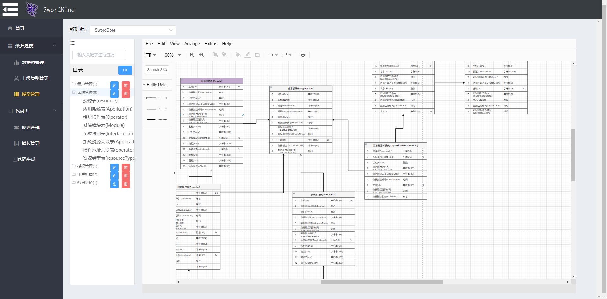

# SwordNine

#### 介绍
SwordNine是一个用于快速进行开发的代码生成平台以及数据建模平台。它可以生成任何语言的重复代码，包括一些简单的数据验证代码，例如：非空、引用完整性、正则、多元化业务唯一属性校验。

#### 软件架构

整个系统采用前后端分离，前端使用vue，后端使用.net core3.1。

后端：

* 框架及数据库：.net core3.1+Mysql8<br/>

* ORM：同时支持Dapper和SqlSugar框架<br/>

* 缓存：支持内存以及redis，可达到无缝切换

前端：

* 框架：Vue2.6+Element
* 2D模型：优秀的开源项目 MxGraph

#### 安装教程

1.  第一步：初始化数据库结构，脚本路径在/doc/数据库脚本/sword_nine.sql
2.  使用vs打开 /src/WebApi/Sword.Nine.sln，并且启动WebApi项目。
3.  使用cmd或者vscode打开/src/FrontWeb/swordnine目录，然后运行 ```npm run serve```
4.  访问本地地址http:localhost:8080
5.  以下为项目运行效果图



#### 整体设计思路及使用说明

1.  请查看项目目录：doc/系统设计及说明.docx


……后续文档，敬请等待。
